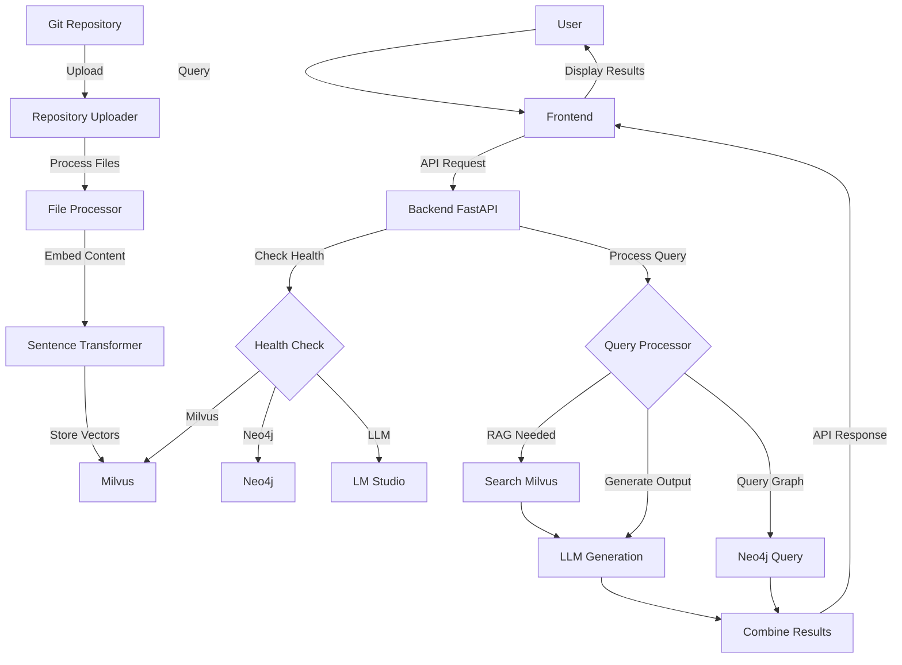

```mermaid
graph TD
    A[User] -->|Query| B[Frontend]
    B -->|API Request| C[Backend FastAPI]
    C -->|Check Health| D{Health Check}
    D -->|Milvus| E[Milvus]
    D -->|Neo4j| F[Neo4j]
    D -->|LLM| G[LM Studio]
    C -->|Process Query| H{Query Processor}
    H -->|RAG Needed| I[Search Milvus]
    H -->|Generate Output| J[LLM Generation]
    H -->|Query Graph| K[Neo4j Query]
    I --> J
    J --> L[Combine Results]
    K --> L
    L -->|API Response| B
    B -->|Display Results| A
    M[Git Repository] -->|Upload| N[Repository Uploader]
    N -->|Process Files| O[File Processor]
    O -->|Embed Content| P[Sentence Transformer]
    P -->|Store Vectors| E
```